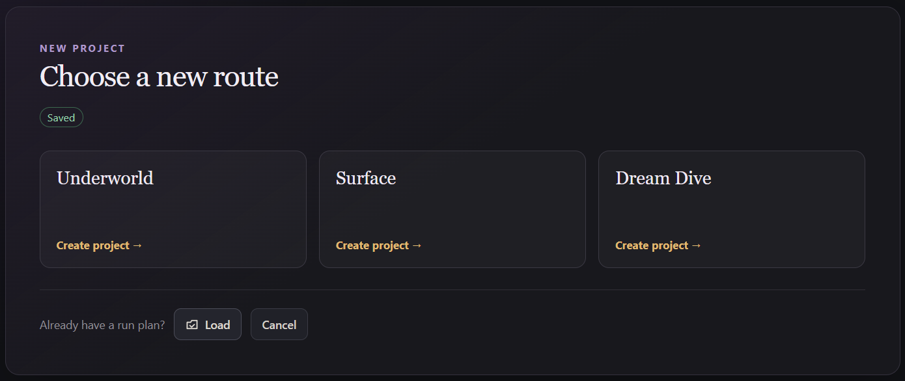
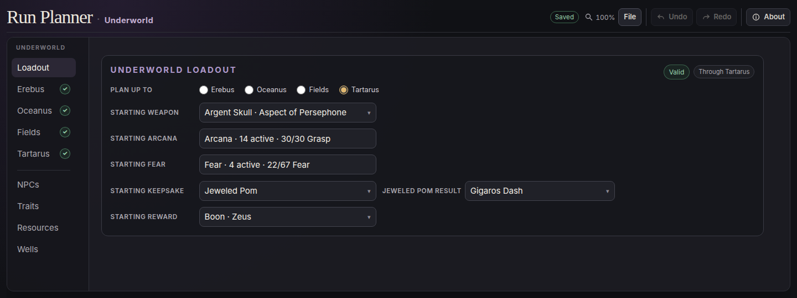
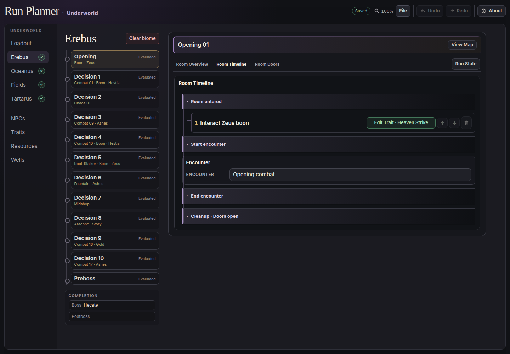
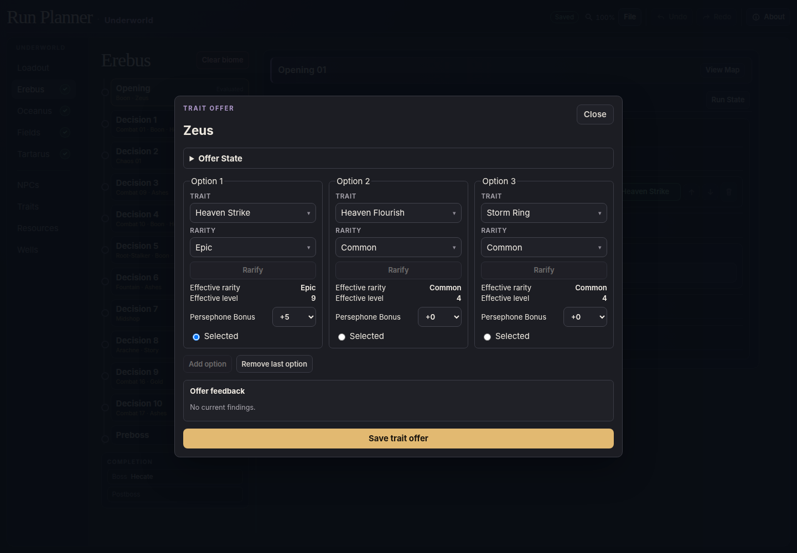
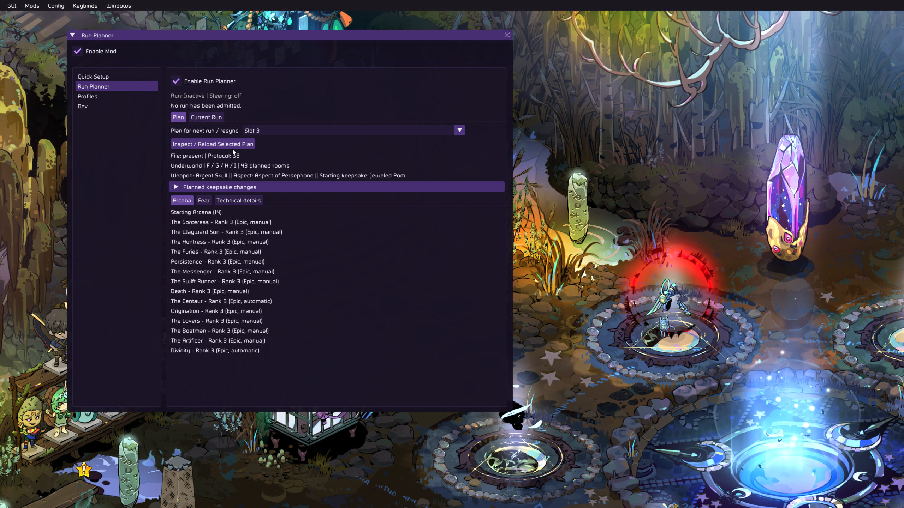
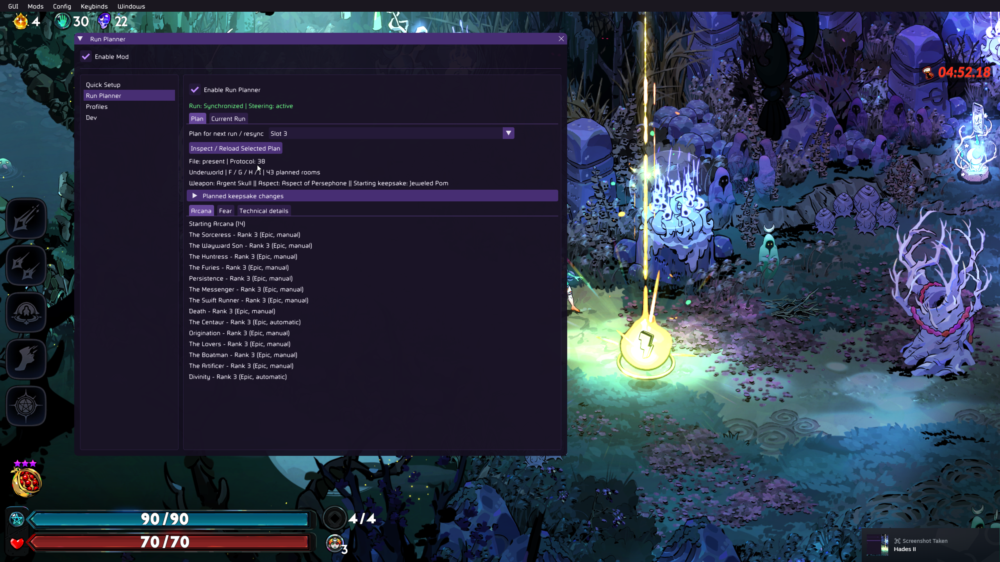
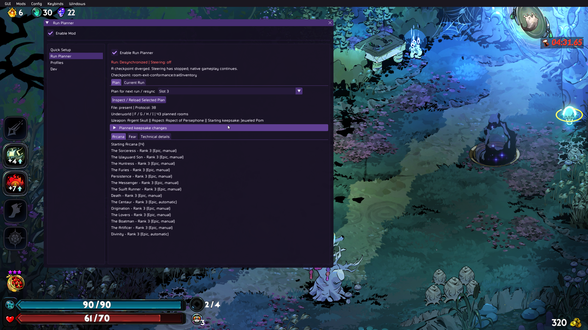

# Run Planner

Design a Hades II run, then play it.

Have a build you want to try? Want to recreate the build and route from the world-record run?
Plan the rooms you'll visit, the boons you'll be offered, and the rewards
you'll pick up along the way. Choose an Underworld or Surface run, or put
together your own biome order in a Dream Dive. You can even choose enemy
lineups and certain boss attacks.

The plan has to work within the game's rules. Run Planner checks your choices
as you build. Every completed plan is checked against the game's rules.
Once it's ready, this mod makes the game follow your plan. You still do the
fighting and make the choices you planned.

## How to use

You'll use two pieces: the Run Planner app to create your plan, and this mod
to play it in Hades II. The app carries the mod and installs it for you.

1. Install **adamant-ModpackLib** in your Hades II r2modman profile. r2modman
   installs its dependencies too.
2. Download and run the Run Planner installer from the
   [planner releases](https://github.com/maybe-adamant/RunPlanner/releases),
   then open **Run Planner**.
3. Open the **Game** panel, choose **Find r2modman profiles**, and pick your
   profile (or **Choose folder…** for the folder containing `ReturnOfModding`
   in a manual Hell2Modding install). Then follow the Game module steps and
   choose **Install**. The Game panel lists anything else to fix first, such as an
   older ModpackLib.
4. Create or load a plan in the app, configure your loadout and route, and
   fix any issues shown by the planner.
5. In the Game panel's **Plans in game**, choose **Send here** on one of the
   six plan slots.
6. Launch the game with that profile. In Run Planner's in-game settings,
   select the published slot as your active plan.
7. Start a new run with the loadout you planned and follow its choices.

After updating the app, open the Game panel and choose **Update**; sending waits
until the installed mod matches the app.

For more about the application and its source, visit the
[planner repository](https://github.com/maybe-adamant/RunPlanner).

You can keep up to six plans ready to play. Changing the active slot during a
run only changes which plan will be used for the next run; it does not replace
the plan already in progress.

### Plan in the app

Create an **Underworld**, **Surface**, or **Dream Dive** project—or load an
existing plan.



Choose your starting weapon, Arcana, Fear, keepsake, and reward in **Loadout**.



Select a room and open **Room Timeline** to configure its planned interactions.



Open **Edit Trait** to configure the offered boons and the one you intend to pick.



### Publish to the game

You can leave choices unfinished or conflicting while editing. Before
publishing, fix the issues the planner points out so the plan passes its
game-rule checks. Then open the **Game** panel.

Under **Plans in game**, choose **Send here** on an empty slot, or **Replace**
on an occupied one. Each slot shows its route and when it was sent, and the
slot holding the plan you have open is marked **current plan**. After the first
send, the header's **Send to game (slot N)** re-sends to that slot. If
something is missing, such as an older ModpackLib or a game module from another
planner version, the Game panel lists what was found and what is required.

### Inspect before starting

Select the slot you published to and click **Inspect / Reload Selected Plan** to check its
loadout. **Inactive | Steering: off** is expected before starting a run.



### While playing

Open the in-game inspector's **Plan** tab to preview the selected slot's
loadout and planned keepsake changes. **Current Run** shows the plan being
played, room progress, and details if something goes wrong. Sync and
steering status stay visible in either tab.

**Synchronized | Steering: active** means the mod is following your plan.

The optional **Show room guide** setting is off by default. Enable it in the
in-game inspector to show read-only, numbered guidance for the current planned
room; it does not make choices or change steering.

The optional **Highlight planned choices** setting is also off by default. It
marks an available planned exit, Ship wheel offer, or trait-screen row when the
exact native object is available; it never selects it for you.



Follow the rooms and choices you planned in the app. If the run no longer
matches the plan, the mod reports the mismatch and stops steering. Normal
gameplay continues—you can keep playing or start a fresh planned run.

**Desynchronized | Steering: off** means the run no longer matches the plan.
Open **Current Run** to see what went wrong.



## Beta and feedback

Run Planner is in beta. You may encounter bugs or differences between your
plan and the game.

If something goes wrong, [report an issue](https://github.com/maybe-adamant/RunPlanner/issues)
with your plan, the room where it happened, what you expected, and what you
actually saw. Include `logOutput.log` from your profile's `ReturnOfModding`
folder when possible.

To find the log when using r2modman:

1. Open File Explorer and paste this into the address bar, then press Enter:

   ```text
   %USERPROFILE%\AppData\Roaming\r2modmanPlus-local\HadesII\profiles\
   ```

2. Open the folder matching the profile you play with (for example, `h2-dev`).
3. Open its `ReturnOfModding` folder.
4. Attach `logOutput.log` to your issue report.

Interested in the code? See the [development guide](CONTRIBUTING.md).
